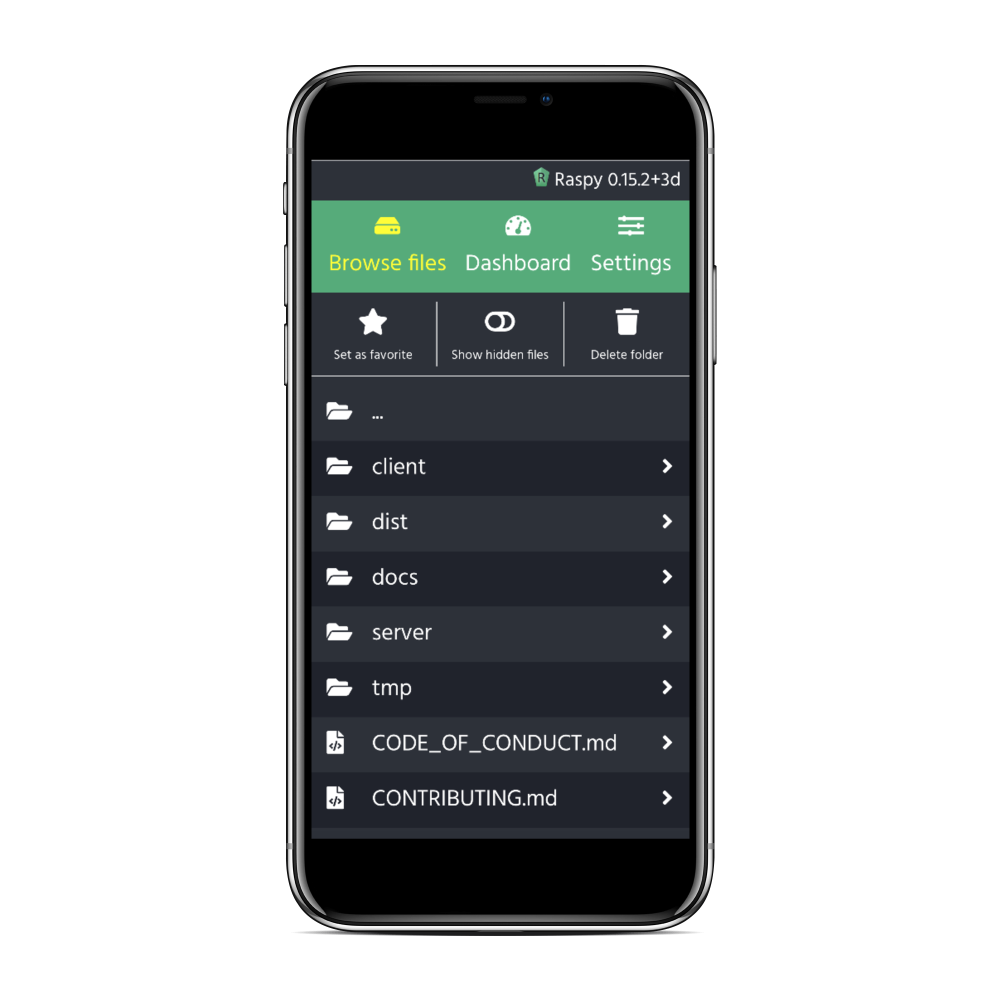

<p align="center">
  
</p>
<p align="center">
  <a href="https://github.com/pkrll/Raspy/releases"></a>
<a href="https://github.com/prkll/Raspy/commits/master"></a>
<a href="https://github.com/pkrll/Raspy/issues"></a>
<a href="https://github.com/pkrll/Raspy/search?l=javascript"></a>
</p>



``RaspBot`` is a lightweight REST API server,esigned for the **Raspberry Pi**, as well as a client web application that let's you control your device with ease.

Built with NodeJS & Express 4 and Vue 2 & Webpack.

**``RaspBot`` is still a work in progress**.

**Features:**

- [ ] Reboot and shutdown
- [x] Browse file system
- [x] Download files
- [ ] Upload files
- [x] Delete files
- [x] Create folders
- [x] Check temperature, CPU, memory and disk usage.
- [x] Interface to update RaspBot remotely

## Table of Contents

* [Prerequisites](#prerequisites)
* [Installation](#installation)
  * [Manually building the client (optional)](#manually-building-the-client-optional)
* [Running the server](#running-the-server)
  * [With a process manager](#with-a-process-manager)
    * [Run the server with PM2](#run-the-server-with-pm2)
    * [Stop the server with PM2](#stop-the-server-with-pm2)
    * [Autostart server on boot](#autostart-server-on-boot)
* [Usage](#usage)
* [Configurations](#configurations)
  * [Enabling HTTPS](#enabling-https)


## Prerequisites

* Node Package Manager (__recommended version 5.7.1+__)
* NodeJS (__recommended version 10.4.1+__)
* Python (__developed for version 2.7.10__)
  * psutil library (__developed using version 5.4.3__)
* PM2 (__required to use the Bootstrapper app__)

## Installation

Clone this repository on your Raspberry Pi:

```bash
$ git clone https://github.com/pkrll/Raspy
```

And run ``make install`` in the project root folder to install and set up the server:

```bash
$ cd Raspy
$ make install
```

### Manually building the client (optional)

The folder ``dist`` inside ``./raspbot`` already contains the latest build of the client. Running the server will use the files there. You can also manually build the client app, by typing ``make build`` in the root folder. This might take a while, so grab a snack and wait for the installation and build processes to finish.

## Running the server

After installing all dependencies and setting up the server, you can run the server with ``make server`` in the root folder.

It is, though, recommended to use a process manager to run the server.

### With a process manager

To daemonize the application, you can use [``PM2``](https://github.com/Unitech/pm2), which is a process manager for NodeJS applications. If you do not have ``PM2`` already, install it:

```bash
$ sudo npm install -g pm2
```

#### Run the server with PM2

Use ``make start`` to run the server in the background. The ``NODE_ENV`` will automatically be set to "production" when using the ``start`` rule.

```bash
$ make start

[PM2] Applying action restartProcessId on app [server](ids: 0)
[PM2] [server](0) ✓
[PM2] Process successfully started
┌──────────┬────┬──────┬───────┬────────┬─────────┬────────┬─────┬───────────┬───────┬──────────┐
│ App name │ id │ mode │ pid   │ status │ restart │ uptime │ cpu │ mem       │ user  │ watching │
├──────────┼────┼──────┼───────┼────────┼─────────┼────────┼─────┼───────────┼───────┼──────────┤
│ Raspbot    │ 0  │ fork │ 13141 │ online │ 0       │ 0s     │ 66% │ 13.9 MB   │ pkrll │ disabled │
└──────────┴────┴──────┴───────┴────────┴─────────┴────────┴─────┴───────────┴───────┴──────────┘
 Use `pm2 show <id|name>` to get more details about an app

```

#### Stop the server with PM2

Use ``make stop`` to stop the server.

#### Autostart server on boot

Follow these steps to make ``PM2`` run on startup.

1. Start the application with ``make start`` (if not already running).
2. Save the current process list with ``pm2 save``.
3. Run ``pm2 startup systemd`` and copy and paste the command produced by the script.

**Example**

```bash
$ make start

$ pm2 save
[PM2] Saving current process list...
[PM2] Successfully saved in /home/pkrll/.pm2/dump.pm2

$ pm2 startup systemd
[PM2] Init System found: systemd
[PM2] To setup the Startup Script, copy/paste the following command:
sudo env PATH=$PATH:[...] startup systemd -u USER --hp /home/USER

$ sudo env PATH=$PATH:[...] startup systemd -u USER --hp /home/USER
```

For more information on how to use PM2, check out **[the official documentation](http://pm2.keymetrics.io/docs/usage/cluster-mode/)** or **[this quickstart guide](https://www.digitalocean.com/community/tutorials/how-to-set-up-a-node-js-application-for-production-on-ubuntu-16-04#manage-application-with-pm2)**.

## Usage

By default, ``RaspBot`` runs on port 5000 and can be accessed by ``http://ip-to-your-pi:5000``.

## Configurations

Current configuration options:

```js
// raspbot/config/index.js
module.exports = {
  oauth: {
    id: '',
    secret: ''
  },
  development: {
    port: 5000,
    databasePath: 'config/db.json',
		httpsPort: 5443,
		httpsOpts: {
			cert: 'config/.sslcert/fullchain.pem',
			key: 'config/.sslcert/privkey.pem'
		}
  },
  production: {
    port: 5000,
    databasePath: 'config/db.json',
		httpsPort: 5443,
		httpsOpts: {
			cert: 'config/.sslcert/fullchain.pem',
			key: 'config/.sslcert/privkey.pem'
		}
  }
}
```

### Enabling HTTPS

To enable HTTPS with ``RaspBot``, you need an SSL certificate. After obtaining it, put the certificate (``fullchain.pem``) and the key (``privkey.pem``) files (or symbolic links to them) in the folder ``config/.sslcert`` and restart the server. (Don't forget to forward port ``443`` to ``5443``.)

## Author

RaspBot was created by **Ardalan Samimi**.
